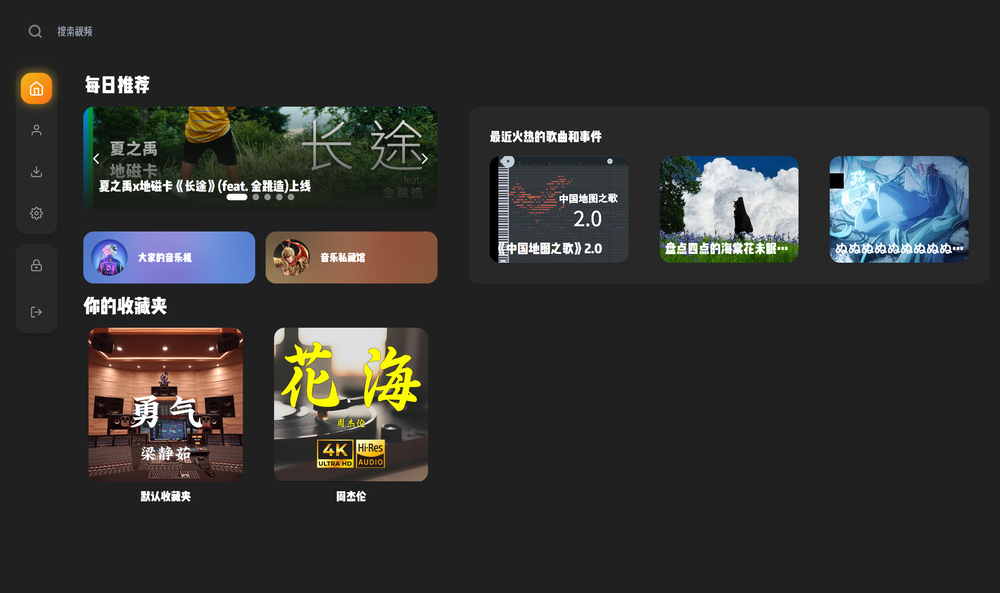

## MaplePlayer

一个专为喜欢用B站当作音乐播放器的用户提供的结合下载，播放，一键登陆，音频可视化的桌面应用程序。

### 部分界面展示



### 任务列表

- [X] 扫码登录
- [X] 播放音视频
- [X] 简易的下载
- [X] 用户收藏列表
- [X] 播放模式
- [ ] 音乐搜索
- [ ] 多线程下载
- [X] 播放列表
- [ ] 更多主题
- [ ] 深色和浅色主题
- [ ] 本地存储cookie
- [ ] 音频可视化
- [ ] 第三方歌词滚动
- [ ] 桌面歌词

### 如何构建项目

```bash
# 克隆项目
git clone https://github.com/TeAnli/maple-player
# 进入项目目录
cd maple-player
# 下载依赖
npm install
# 启动项目
npm run tauri dev
```

### 如何贡献代码

本项目使用 typescript 和 rust 语言开发

rust 处理文件和网络请求
> 请将所有API请求在后端进行处理（遵循蛇形命名法）

typescript 处理前端交互
> typescript 请勿在UI项目下使用任何与操作系统和文件相关的API，以保证UI和后端能够隔离 （遵循驼峰命名法）

### 鸣谢
[BiliBili-API-Collect](https://github.com/TeAnli/bilibili-API-collect)

[VSCode](https://github.com/microsoft/vscode)

[BBHouse](https://github.com/endcloud/bbhouse-tauri)